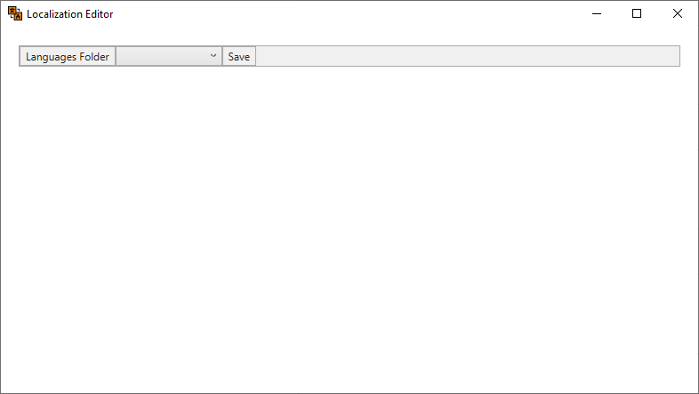
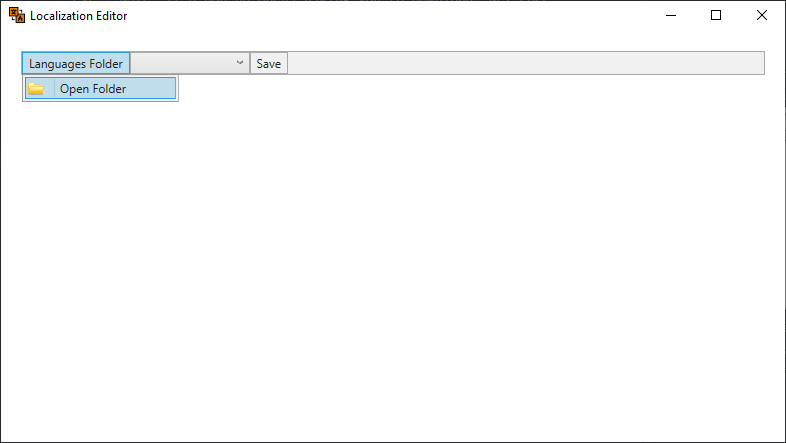
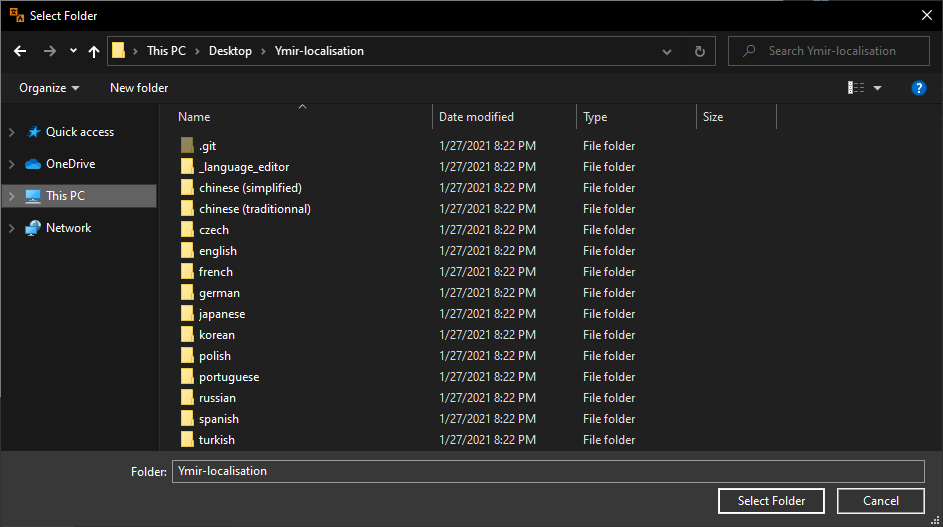
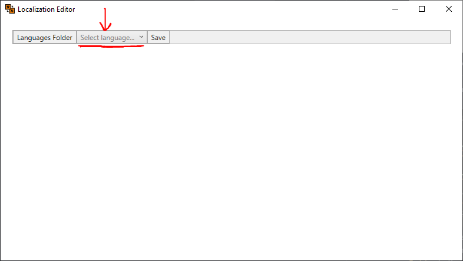
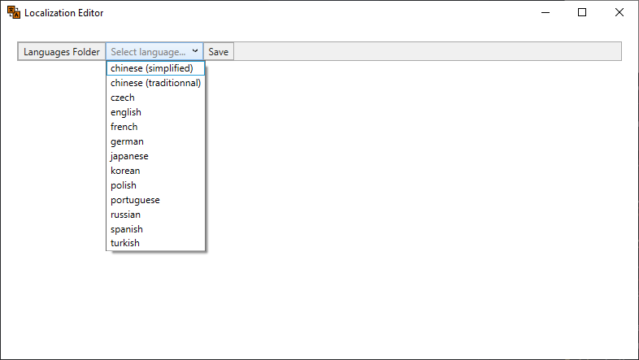
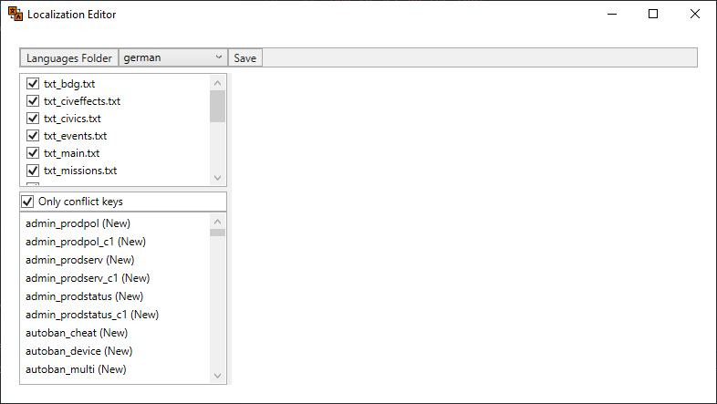

# Language Editor

The language editor is a tool which eases the translation of the game's strings. It includes a versioning system similar to Git, which finds the differences between the keys of the `parent_language` and the localization itself, and differentiates them in 4 states:  
- "OK": Both keys have the same version.
- "New": The localization key doesn't exist.
- "Deleted": The localization key is no longer needed.
- "Old": The localization key isn't updated to the latest reference (`parent_language`) version.

All the extra keys ("Deleted" state) and files are automatically deleted, and all the keys in the localization text files are automatically sorted alphabetically, improving the overall order.

##  How to download and install the tool

1) Clone the repository (Either use a Source Control program (I personally use the VS Code built-in) or go in GitHub and click the green button `Code`, and then `Download ZIP`. The last way is easier but doesn't offer the advantages of having a git repository, so consider doing it in the first way).
2) Open the `_language_editor` folder.
3) Execute the editor by double-clicking `LocalisationsEditor.exe`. NOTE: If a pop-up opens asking you to download .NET Core, follow the instructions, which summarized are:
   - Download and install the [.NET Core 5.0 Runtime](https://dotnet.microsoft.com/download/dotnet/current/runtime).
   - Execute again `LocalisationsEditor.exe`.

##  How to set up the tool

1) At this point, you should see something like this: 
2) In order to open the folder which contains all the localizations, click on `Languages Folder` (top-left corner), and then `Open Folder`. 
3) This should open a new window asking you to open the folder. Browse to the correct directory (`Ymir-localisation`), and then click `Select Folder` (bottom-right corner). 
4) Now, a new grey text saying `Select language...` should appear in the menu item to the right of `Languages Folder` button. 
5) Click it, and a dropdown displaying all the available localizations should appear. Finally select the language you want to edit. 

##  How to use the tool

1) Once you've selected a language from the dropdown menu, you should see many frames appearing. 
   - The first frame (top-left) displays all the text files contained in the `parent_language` folder (which by default should be "english"). As you might have noticed, to the left of every file name (for instance `txt_bdg`), there is a little checkbox which if checked, shows the all keys contained in that file in the next frame (the frame below this one), otherwise it doesn't show them; this feature might be useful to translate a file at a time. NOTE: All the files that weren't already present in the localization folder (in this case I've chosen "german"), will be created automatically, so don't worry about doing anything outside the editor.
   - The second frame (middle-left) has a checkbox "Only conflict keys" and a list of strings, which are the keys. If the checkbox is enabled, it will show only the keys that need some work or revision ("New", "Deleted" and "Old" state), else if disabled, it will show the list of all the keys (including the "OK" state). 
2) If you click on a key, it will get selected and some new frames will appear on the right. 
   - Here are the purposes of the texts, starting from the top one:
     - Name of the key (without '#'). (`admin_prodpol`)
     - Description of the state of the key. (`This is a new key; ...`)
     - Name of the `parent_language` (english) and version of the key. (`english(v1)`)
     - `parent_language` (english) translation. (`Active policies`)
     - Name of the selected localization (in this case I've chosen "german") and version or state of the key. (`german (new)`)
     - "german" translation (in this case the translation is empty because the key is new, hence no translation). This is the place where you'll spend most of the time, since it is where you have to write the translations.

The first time you open a localization, you might find some italic greyed-out keys at the bottom of the list. Those are all the "Deleted" keys, which are the obsolete keys. Don't worry about them, the editor will delete them when saving.

NOTE: The saving system automatically saves all the changes when quitting the program. When you click the `Save` button, besides saving, it will also update the conflicted keys removing from the list all the keys that you had translated, since you "resolved" them. You can still find them by unchecking `Only conflic keys` and searching for the key's name.